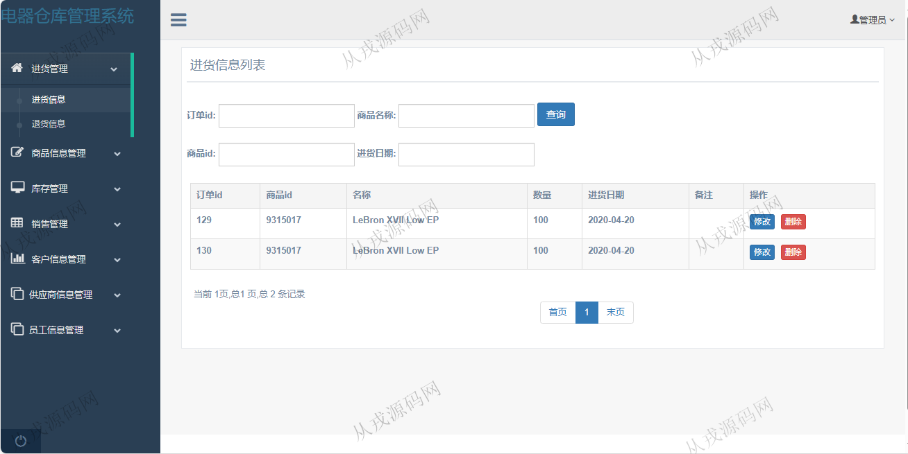
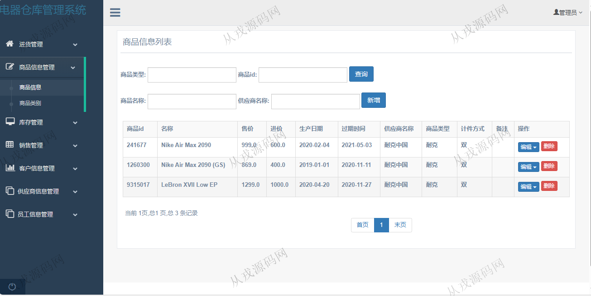
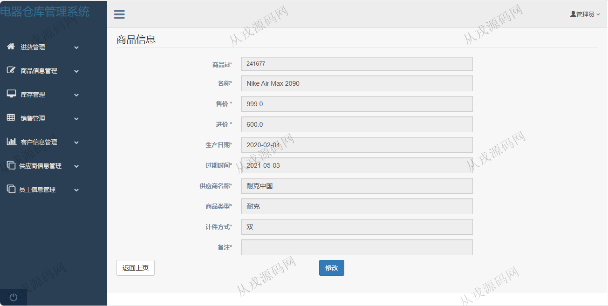
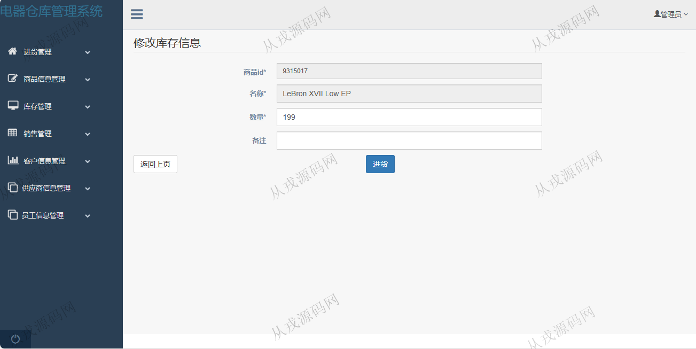
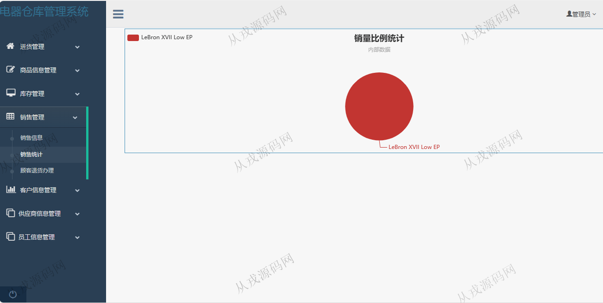
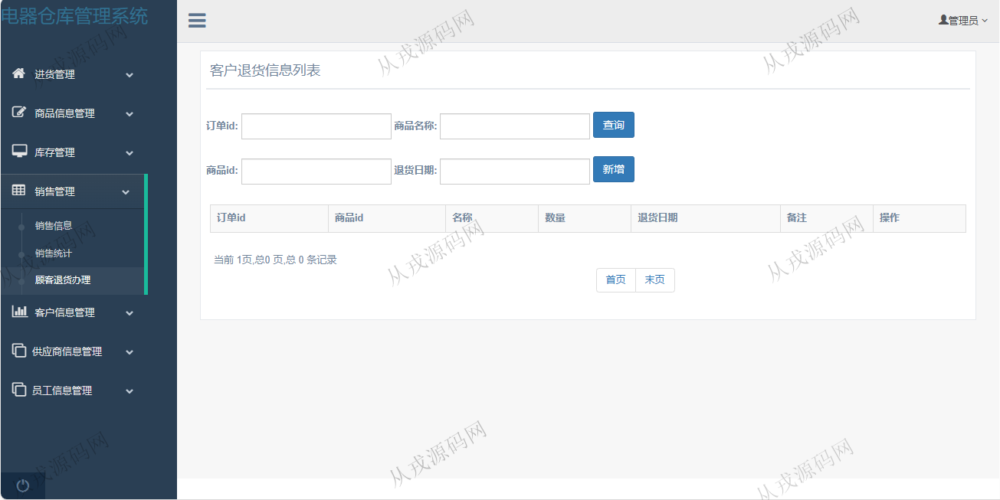
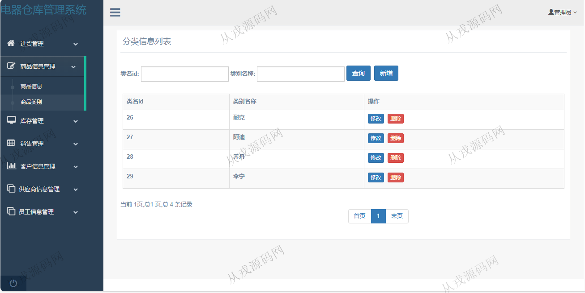
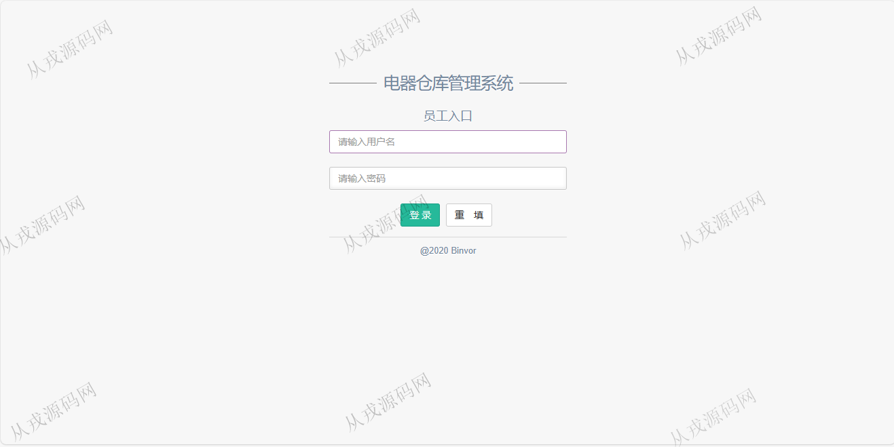
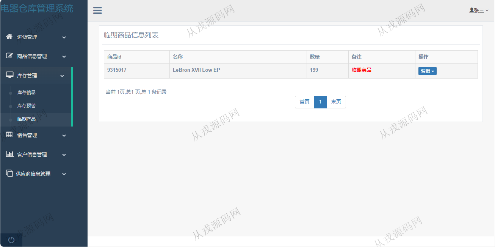

<h1 align="center">102.仓库管理系统</h1>

- <b>完整代码获取地址：从戎源码网 ([https://armycodes.com/](https://armycodes.com/))</b>
- <b>技术探讨、资料分享，请加QQ群：692619798</b> 
- <b>作者微信：19941326836  QQ：952045282</b> 
- <b>承接计算机毕业设计、Java毕业设计、Python毕业设计、深度学习、机器学习</b>
- <b>选题+开题报告+任务书+程序定制+安装调试+论文+答辩ppt 一条龙服务</b>
- <b>所有选题地址 ([https://github.com/YuLin-Coder/AllProjectCatalog](https://github.com/YuLin-Coder/AllProjectCatalog)) </b>

## 项目介绍
基于ssm的仓库管理系统：前端 jsp、jquery、bootstrap，后端 maven、springmvc、spring、mybatis，角色分为管理员、员工；集成进货管理、商品信息管理、库存管理、销售管理等功能于一体的系统。

## 功能介绍

- 进货管理：进货信息的修改和删除，列表查询，多条件搜索查询，退货信息的列表查询，新增，修改和删除
- 商品信息管理：商品信息的增删改查
- 商品类别管理：商品类别的增删改查
- 库存信息：库存列表查询，详情查看，进货操作
- 库存预警：预警列表查询，商品在库存数量达到一定值时，触发预警
- 临期产品：临期产品列表查询，详情查看，促销操作
- 销售信息：销售信息列表查询，新增，详情查看，信息删除
- 销售统计：销量比例统计（饼图）
- 顾客退货办理：订单列表，退货操作
- 客户信息管理：客户信息的增删改查
- 供应商管理：供应商信息的增删改查
- 员工信息管理：员工信息的增删改查

## 环境

- <b>IntelliJ IDEA 2021.3</b>

- <b>Mysql 5.7.26</b>

- <b>Tomcat 7.0.73</b>

- <b>JDK 1.8</b>

## 运行截图

